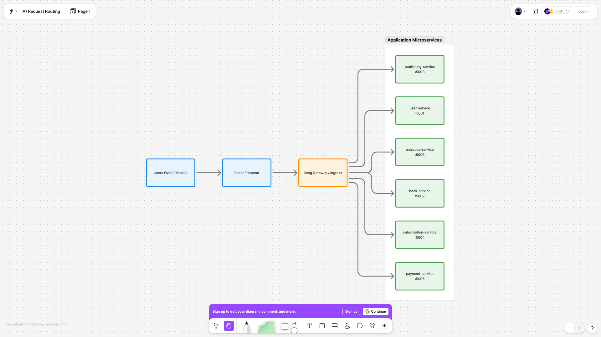
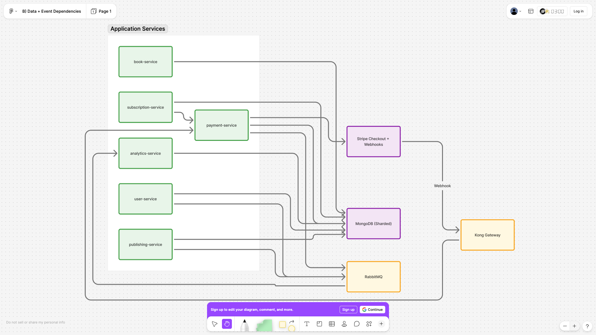
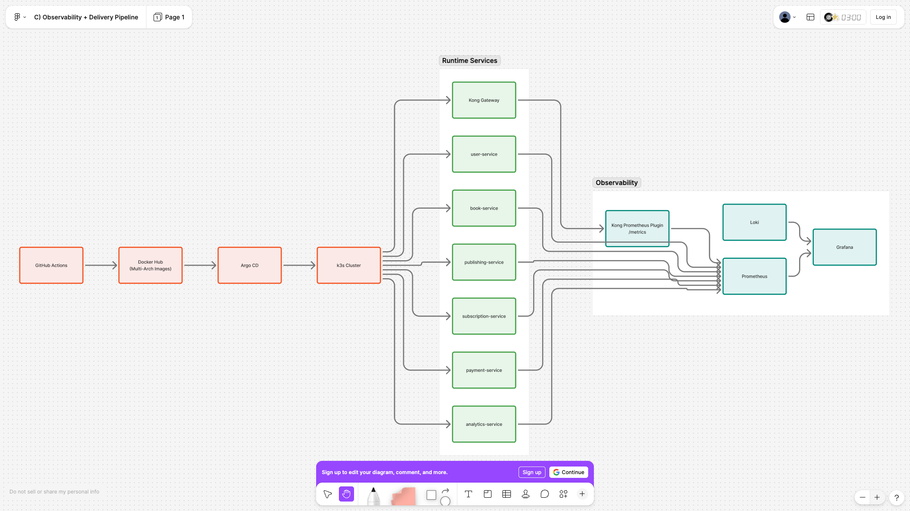
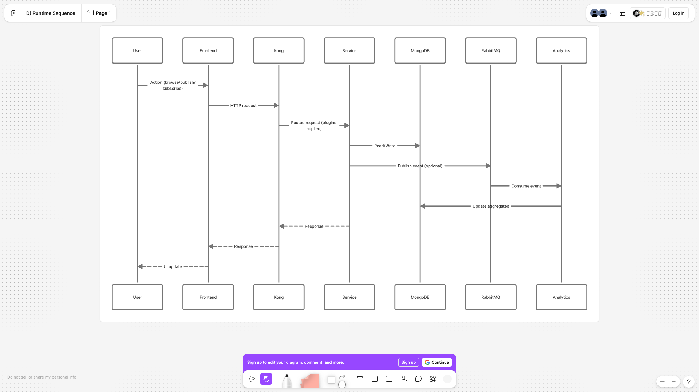

# OpenLeaf Reader Platform: Engineer Onboarding (E2E)

This guide is the execution path for standing up the full platform end-to-end, with exact project paths and command flow.

## Project Background

OpenLeaf Reader Platform is an end-to-end cloud-native online reading system designed for high-scale digital reading use cases. The goal is to support large reader traffic, personalized book access, publishing workflows, subscription billing, and analytics in one production-style architecture.

The platform models a real business environment where thousands to millions of readers can browse titles, track reading progress across devices, subscribe to premium plans, and receive reliable low-latency responses through an API gateway. Internally, it uses microservices, asynchronous event flows, resilient data services, observability tooling, and GitOps delivery patterns to reflect how modern reading platforms are built and operated.

This repository is structured so an engineer can onboard quickly, understand service dependencies, deploy the full stack, run operational tests (including chaos scenarios), and trace request flow from user entry to data/event outcomes.

## Industry-Inspired Architecture Principles

- API gateway at the edge with layered controls: authentication, authorization, rate limiting, request/response transformation, and traffic policy.
- Domain microservices with clear service boundaries and independent deployability.
- Event-driven integration for non-blocking workflows (progress sync, analytics updates, subscription/payment confirmations).
- Stateless application pods with externalized state in managed data systems.
- GitOps-style delivery with declarative manifests and environment consistency across deploys.
- Security and reliability embedded in platform workflows (DevSecOps + SRE), not treated as post-deploy add-ons.

## Scale Assumptions

- Reader population target: 100K to multi-million registered users.
- Concurrent active sessions: thousands during normal traffic, with burst conditions during promotions or launches.
- Read traffic dominates write traffic (catalog browse + reading fetches), with periodic write spikes (progress sync, subscriptions, publishing events).
- Global/mobile usage patterns require resilient APIs with stable latency under variable network quality.
- Core objective: maintain service continuity during pod/node/network disruptions and recover quickly from gateway or upstream faults.

## Operational SLO / SLI Targets

- API availability SLO: 99.9% monthly for critical reader-facing routes.
- Latency SLO: p95 < 300ms for core read endpoints under baseline load; p99 tracked for incident response.
- Error-rate SLO: < 1% 5xx on gateway and core service paths (excluding planned chaos windows).
- Recovery objective: gateway path stabilizes within minutes for single-pod failure scenarios.
- Delivery reliability: GitOps sync and rollback paths validated for all production-impacting manifest changes.
- Observability requirement: every request path must be traceable via metrics + logs for incident triage.

Set these variables first:

```bash
export PROJECT_ROOT="$(pwd)"
export KUBE_NS="openleaf-e2e"
export KONG_PROXY_URL="http://localhost:8000"
export ARGOCD_NS="argocd"
export CHAOS_NS="chaos-testing"
export TARGET_PLATFORMS="linux/amd64,linux/arm64"
export GHCR_OWNER="temitayocharles"
export IMAGE_TAG="latest"
export GITHUB_REPO_URL="https://github.com/temitayocharles/OpenLeaf-Reader-Platform.git"
```

Project root:
`$PROJECT_ROOT`

## Stack Diagram (End-to-End)

### A) Request Routing (User -> Kong -> Services)




### B) Data + Event Dependencies




### C) Observability + Delivery Pipeline




### D) End-to-End Runtime Sequence (Example)




Request-to-workflow summary:
- User request enters via frontend, then Kong routes to domain service.
- Services read/write MongoDB and publish events to RabbitMQ.
- Analytics consumes RabbitMQ events and updates insights.
- Subscription/payment flow goes through payment-service + Stripe webhook callback via Kong.
- Metrics/logs are collected into Prometheus/Loki and visualized in Grafana.
- CI/CD publishes multi-arch images and Argo CD syncs workloads to k3s.

## 1) What Exists Already

All scaffolding and code/config blocks from `new-new.md` are pre-created under this repo:

- Backend services: `services/*-service/`
- Shared utility: `services/shared/utils.py`
- Frontend: `frontend/`
- Kubernetes manifests: `k8s/`
- Kong hardening: `k8s/kong-hardened-advanced.yaml`
- Chaos manifests: `k8s/chaos/*` and `k8s/chaos/kong/*`
- CI/CD workflow: `.github/workflows/ci-cd.yaml`
- Seed script: `scripts/seed_db.py`
- Helm chart source: `helm-charts/charts/*`
- GitOps runbook: `docs/GITOPS_HELM_E2E.md`
- CPU triage guide: `docs/CLUSTER_CPU_WARNING_TRIAGE.md`

## 2) Local Prerequisites

Run once:

```bash
brew install git python@3.10 node@18 helm argocd trivy k6
```

Optional shell consistency:

```bash
alias kubectl='k3s kubectl'
```

Cluster check:

```bash
k3s kubectl get nodes
k3s kubectl get pods -A
```

## 3) Service Dependency Install (Local Dev)

From project root:

```bash
cd "$PROJECT_ROOT"
```

Install backend deps per service:

```bash
python3 -m venv venv
source venv/bin/activate
pip install flask pymongo pyjwt pika stripe requests prometheus-flask-exporter python-dotenv
```

Install frontend deps:

```bash
cd frontend
npm install
cd ..
```

## 4) Infrastructure Layer (Mongo + RabbitMQ + Kong)

### 4.1 Helm repos

```bash
helm repo add bitnami https://charts.bitnami.com/bitnami
helm repo add kong https://charts.konghq.com
helm repo add prometheus-community https://prometheus-community.github.io/helm-charts
helm repo add grafana https://grafana.github.io/helm-charts
helm repo add chaos-mesh https://charts.chaos-mesh.org
helm repo update
```

### 4.2 MongoDB (stable minimal path)

```bash
kubectl create namespace "$KUBE_NS" --dry-run=client -o yaml | kubectl apply -f -

kubectl -n "$KUBE_NS" apply -f - <<'YAML'
apiVersion: apps/v1
kind: Deployment
metadata:
  name: mongo-mongodb
spec:
  replicas: 1
  selector:
    matchLabels: {app: mongo-mongodb}
  template:
    metadata:
      labels: {app: mongo-mongodb}
    spec:
      containers:
      - name: mongo
        image: mongo:7
        ports:
        - containerPort: 27017
---
apiVersion: v1
kind: Service
metadata:
  name: mongo-mongodb
spec:
  selector: {app: mongo-mongodb}
  ports:
  - port: 27017
    targetPort: 27017
YAML
```

### 4.3 RabbitMQ (stable minimal path)

```bash
kubectl -n "$KUBE_NS" apply -f - <<'YAML'
apiVersion: apps/v1
kind: Deployment
metadata:
  name: rabbit-rabbitmq
spec:
  replicas: 1
  selector:
    matchLabels: {app: rabbit-rabbitmq}
  template:
    metadata:
      labels: {app: rabbit-rabbitmq}
    spec:
      containers:
      - name: rabbitmq
        image: rabbitmq:3-management
        ports:
        - containerPort: 5672
        - containerPort: 15672
        env:
        - name: RABBITMQ_DEFAULT_USER
          value: guest
        - name: RABBITMQ_DEFAULT_PASS
          value: guest
---
apiVersion: v1
kind: Service
metadata:
  name: rabbit-rabbitmq
spec:
  selector: {app: rabbit-rabbitmq}
  ports:
  - name: amqp
    port: 5672
    targetPort: 5672
  - name: http
    port: 15672
    targetPort: 15672
YAML
```

### 4.4 Kong (optional ingress path)

```bash
helm upgrade --install kong kong/kong \
  --namespace "$KUBE_NS" \
  --set proxy.type=ClusterIP \
  --set ingressController.enabled=true \
  --set ingressController.installCRDs=true
```

Apply base Kong config/routes/plugins only after Kong is ready:

```bash
kubectl apply -f k8s/kong-config.yaml
```

## 5) Data and Secrets

Set Mongo URI (adapt your service name/IP if needed):

```bash
export MONGO_URI="mongodb://mongo-mongodb:27017/openleaf_db"
```

Seed data:

```bash
python scripts/seed_db.py
```

Prepare runtime config manifests:

```bash
cp k8s/app-secrets.yaml k8s/app-secrets.local.yaml
```

Edit `k8s/app-secrets.local.yaml` and set:

- `JWT_SECRET`
- `MONGO_URI` (use `$MONGO_URI` from above if preferred)
- `STRIPE_SECRET`
- `STRIPE_WEBHOOK_SECRET`
- `STRIPE_PRICE_BASIC`
- `STRIPE_PRICE_PREMIUM`

Apply runtime config:

```bash
kubectl apply -f k8s/app-config.yaml
kubectl apply -f k8s/app-secrets.local.yaml
```

## 6) Build and Run Services (Local Path)

For each backend service, build multi-arch images (manifest list) and push:

```bash
docker login
```

```bash
cd services/user-service && docker buildx build --platform "$TARGET_PLATFORMS" -t "ghcr.io/$GHCR_OWNER/openleaf-user-service:$IMAGE_TAG" --push . && cd ../..
cd services/book-service && docker buildx build --platform "$TARGET_PLATFORMS" -t "ghcr.io/$GHCR_OWNER/openleaf-book-service:$IMAGE_TAG" --push . && cd ../..
cd services/publishing-service && docker buildx build --platform "$TARGET_PLATFORMS" -t "ghcr.io/$GHCR_OWNER/openleaf-publishing-service:$IMAGE_TAG" --push . && cd ../..
cd services/subscription-service && docker buildx build --platform "$TARGET_PLATFORMS" -t "ghcr.io/$GHCR_OWNER/openleaf-subscription-service:$IMAGE_TAG" --push . && cd ../..
cd services/payment-service && docker buildx build --platform "$TARGET_PLATFORMS" -t "ghcr.io/$GHCR_OWNER/openleaf-payment-service:$IMAGE_TAG" --push . && cd ../..
cd services/analytics-service && docker buildx build --platform "$TARGET_PLATFORMS" -t "ghcr.io/$GHCR_OWNER/openleaf-analytics-service:$IMAGE_TAG" --push . && cd ../..
```

Frontend image (multi-arch + push):

```bash
cd frontend && docker buildx build --platform "$TARGET_PLATFORMS" -t "ghcr.io/$GHCR_OWNER/openleaf-frontend:$IMAGE_TAG" --push . && cd ..
```

## 7) Kubernetes App Deployment

Base deployment manifest in repo:

- `k8s/app-config.yaml`
- `k8s/app-secrets.local.yaml`
- `k8s/user-deployment.yaml`
- `k8s/services-deployments.yaml`

Apply in this order:

```bash
kubectl apply -f k8s/app-config.yaml
kubectl apply -f k8s/app-secrets.local.yaml
kubectl apply -f k8s/user-deployment.yaml
kubectl apply -f k8s/services-deployments.yaml
```

Then apply remaining manifests under `k8s/`.

Post-deploy verification:

```bash
KUBE_NS="$KUBE_NS" KONG_PROXY_URL="$KONG_PROXY_URL" ./scripts/verify_runtime.sh
```

## 8) Stripe Flow Enablement

Files involved:

- Backend checkout/webhook: `services/payment-service/app.py`
- Subscription bridge service: `services/subscription-service/app.py`
- Frontend subscribe UI: `frontend/src/components/SubscriptionPage.js`
- Frontend key env: `frontend/.env.example` (copy to `.env`)

Set real Stripe test values:

- `STRIPE_PRICE_BASIC`, `STRIPE_PRICE_PREMIUM` as environment variables for `payment-service`
- `STRIPE_SECRET`, `STRIPE_WEBHOOK_SECRET` as environment variables for `payment-service`
- `REACT_APP_STRIPE_PUBLISHABLE_KEY` in `frontend/.env`

Kubernetes location for Stripe/JWT values:

- `k8s/app-secrets.local.yaml`

Webhook endpoint through Kong path:

- `/payments/webhook`

Publishing and subscription services are fully implemented in:

- `services/publishing-service/app.py`
- `services/subscription-service/app.py`

Quick checks:

```bash
curl -X POST "$KONG_PROXY_URL/publish" \
  -H "Authorization: Bearer <your-jwt>" \
  -H "Content-Type: application/json" \
  -d '{"title":"My First Book","author":"sssh","genre":"fiction","content_url":"s3://fake/epub"}'

curl "$KONG_PROXY_URL/subscriptions" -H "Authorization: Bearer <your-jwt>"
```

## 9) Frontend Local Run

```bash
cd frontend
npm start
```

Expected routes in `frontend/src/App.js`:

- `/login`
- `/books`
- `/publish`
- `/subscriptions`
- `/subscriptions/success`
- `/subscriptions/cancel`
- `/progress`
- `/analytics`
- `/insights`

## 10) CI/CD + GitOps

Workflow files:

- `.github/workflows/ci-cd.yaml` (CI)
- `.github/workflows/cd-release.yaml` (CD)

Set GitHub secrets:

- `GITHUB_TOKEN` with `packages:write` (auto-provided in GitHub Actions)
- `GHCR_TOKEN` (recommended for CD publish to GHCR; PAT with `write:packages`)
- `GHCR_USERNAME` (optional; defaults to workflow actor)

Argo CD install:

```bash
kubectl create namespace "$ARGOCD_NS"
kubectl apply -n "$ARGOCD_NS" -f https://raw.githubusercontent.com/argoproj/argo-cd/stable/manifests/install.yaml
```

Create app:

```bash
argocd app create openleaf-app \
  --repo "$GITHUB_REPO_URL" \
  --path k8s \
  --dest-server https://kubernetes.default.svc \
  --dest-namespace "$KUBE_NS" \
  --sync-policy automated
```

## 11) Observability Stack

Install Prometheus/Grafana:

```bash
helm install prom prometheus-community/kube-prometheus-stack --set grafana.adminPassword=admin
```

Install Loki:

```bash
helm install loki grafana/loki-stack
```

Grafana dashboard configmap file:

- `k8s/grafana-dashboards-configmap.yaml`

Dashboard starter file:

- `k8s/grafana-dashboards/openleaf-overview.json`

Enable Kong gateway metrics plugin:

- `k8s/kong-prometheus.yaml`

Apply:

```bash
kubectl apply -f k8s/kong-prometheus.yaml
```

Optional Helm annotation upgrade for scrape hints:

```bash
helm upgrade kong kong/kong --reuse-values \
  --set proxy.annotations."prometheus\\.io/scrape"="true" \
  --set proxy.annotations."prometheus\\.io/port"="9119" \
  --set proxy.annotations."prometheus\\.io/path"="/metrics"
```

PromQL examples for Grafana:

```promql
sum(rate(kong_http_requests_total[5m]))
sum(rate(kong_http_requests_total[5m])) by (route)
histogram_quantile(0.99, sum(rate(kong_http_latency_seconds_bucket[5m])) by (le))
sum(rate(kong_upstream_errors_total[5m]))
sum(rate(kong_plugin_executions_total[5m])) by (plugin)
```

## 12) Kong Deep Dive (Operational)

### 12.1 Live debug

```bash
kubectl get pods -l app.kubernetes.io/name=kong-gateway,app.kubernetes.io/component=proxy
kubectl exec -it <kong-proxy-pod> -c proxy -- /bin/sh
kong version
curl -s http://localhost:8001/status
tail -f /usr/local/kong/logs/access.log /usr/local/kong/logs/error.log
```

From host:

```bash
kubectl port-forward svc/kong-kong-proxy 8000:80
curl -v "$KONG_PROXY_URL/users/health"
```

### 12.2 decK

```bash
brew install deck
kubectl port-forward svc/kong-kong-admin 8001:8001
deck dump --output-file my-kong-config.yaml --format yaml
deck diff --state my-kong-config.yaml
deck sync --state my-kong-config.yaml
```

### 12.3 Advanced hardening chain

Manifest path:

- `k8s/kong-hardened-advanced.yaml`

Apply:

```bash
kubectl apply -f k8s/kong-hardened-advanced.yaml
```

Abuse tests:

```bash
kubectl port-forward svc/kong-kong-proxy 8000:80
for i in {1..100}; do curl -s -o /dev/null -w "%{http_code}\n" "$KONG_PROXY_URL/ultra-secure/health"; done
curl -A "malicious-bot/1.0" "$KONG_PROXY_URL/ultra-secure/health"
curl "$KONG_PROXY_URL/ultra-secure/users"
```

## 13) Chaos Engineering

Install Chaos Mesh:

```bash
kubectl create ns "$CHAOS_NS"
helm install chaos-mesh chaos-mesh/chaos-mesh \
  --namespace "$CHAOS_NS" \
  --set dashboard.create=true \
  --set chaosDaemon.runtime=containerd \
  --set chaosDaemon.socketPath=/run/k3s/containerd/containerd.sock
```

Base chaos manifests:

- `k8s/chaos/payment-pod-kill.yaml`
- `k8s/chaos/analytics-network-delay.yaml`
- `k8s/chaos/mongo-stress.yaml`
- `k8s/chaos/payment-http-abort.yaml`

Kong-targeted chaos manifests:

- `k8s/chaos/kong/kong-pod-kill.yaml`
- `k8s/chaos/kong/kong-network-chaos.yaml`
- `k8s/chaos/kong/kong-stress.yaml`
- `k8s/chaos/kong/kong-http-fault.yaml`

Kong pod-kill run sequence:

```bash
kubectl label pods -l app.kubernetes.io/name=kong-gateway,app.kubernetes.io/component=proxy chaos-target=kong-proxy --overwrite
kubectl get pods -l chaos-target=kong-proxy
kubectl port-forward svc/kong-kong-proxy 8000:80 &
kubectl apply -n "$CHAOS_NS" -f k8s/chaos/kong/kong-pod-kill.yaml
```

Traffic watch loop:

```bash
while true; do
  curl -s -w "%{http_code} %{time_total}s   %{url_effective}\n" "$KONG_PROXY_URL/users/health" || echo "FAIL $(date)"
  sleep 0.4
done
```

Cleanup:

```bash
kubectl delete -n "$CHAOS_NS" -f k8s/chaos/kong/kong-pod-kill.yaml
kubectl delete podchaos kong-proxy-pod-kill-once -n "$CHAOS_NS"
```

## 14) Known Placeholders

- Frontend Stripe publishable key must be set in `frontend/.env`

## 15) Fast File Index

- Core guide source: `<workspace>/new-new.md`
- Scaffolded project: `$PROJECT_ROOT`
- Onboarding guide (this file): `$PROJECT_ROOT/README.md`
